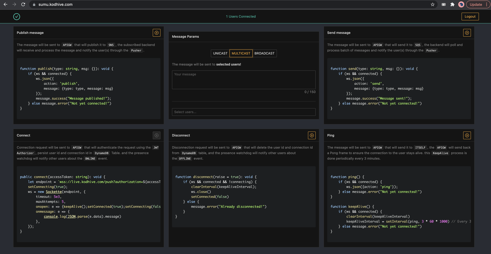

# AWS SUMU DEMO

Demo client/server Websocket Application that leverage [SUMU stack](https://github.com/obytes/terraform-aws-sumu) as a 
messaging backbone.

Live Demo is here: [https:sumu.kodhive.com](https:sumu.kodhive.com)



## Prerequisites

To test this demo with your own infrastructure, you have to provision a SUMU stack. you will find instructions on how 
you can deploy a SUMU stack [here](https://github.com/obytes/terraform-aws-sumu) 


## Server

The server is an AWS Lambda Function which is:

- Subscribed to SUMU output messages SNS Topic.
- Has SUMU output messages SQS queue as event source.
- Publish notifications though SUMU input notifications SNS Topic.
- Sends notifications through SUMU input notifications SQS Queue.

### Server Environment variables

The required environment variables by the server are:

- `CONNECTIONS_TABLE`: SUMU DynamoDB connections table.
  
- `NOTIFICATIONS_TOPIC_ARN`: SUMU Input Notifications topic ARN.
  
- `NOTIFICATIONS_QUEUE_URL`: SUMU Input Notifications topic ARN.

## Client

The client is a React Application which implement these features:

- Sign in using Google SSO with Firebase.
- Connects to SUMU websocket API Gateway.
- Disconnect from SUMU websocket API Gateway.
- Periodic KeepAlive (Ping/Pong) to keep connections active.
- Publishing messages to the messages SNS Topic through API Gateway.
- Sending messages to the messages SQS Queue through API Gateway.
- Retrieve the list of connected users.
- Receives users ONLINE/OFFLINE events and update the connected users list accordingly.
- Implement multiple publish and send push modes:
    - UNICAST: sends an echo message that will be received by just the sender.
    - MULTICAST: sends a message to multiple selected users except the sender.
    - BROADCAST: sends a message to all connected users except the sender.

### Client Environment variables

The required environment variables by the client app are:

- `REACT_APP_FIREBASE_API_KEY`: Firebase API Key
  
- `REACT_APP_FIREBASE_PROJECT_ID`: Firebase Project ID
  
- `REACT_APP_FIREBASE_AUTH_DOMAIN`: Firebase Auth Domain
  
- `REACT_APP_FIREBASE_MEASUREMENT_ID`: Firebase measurement ID
  
- `REACT_APP_WEBSOCKET_URL`: SUMU 

### Deploying

You can deploy the server as an AWS Lambda Function using the Terraform Module in [infra](infra)

```hcl
module "sumu_demo" {
  source = "./infra"
  prefix = local.prefix
  common_tags = local.common_tags

  # Input
  messages_topic_arn = module.sumu.messages["topic"]["arn"]
  messages_queue_arn = module.sumu.messages["queue"]["arn"]

  # Output
  notifications_topic = module.sumu.notifications["topic"]
  notifications_queue = module.sumu.notifications["queue"]

  connections_table = module.sumu.connections_table

  # Github
  pre_release  = true
  s3_artifacts = {
    arn    = aws_s3_bucket.artifacts.arn
    bucket = aws_s3_bucket.artifacts.bucket
  }
  github = {
    owner          = "obytes"
    webhook_secret = "not-secret"
    connection_arn = "arn:aws:codestar-connections:us-east-1:{ACCOUNT_ID}:connection/{CONNECTION_ID}"
  }
  github_repository = {
    name   = "aws-sumu-demo"
    branch = "main"
  }
  # Notifications
  ci_notifications_slack_channels = {
    info  = "ci-info"
    alert = "ci-alert"
  }
}
```
